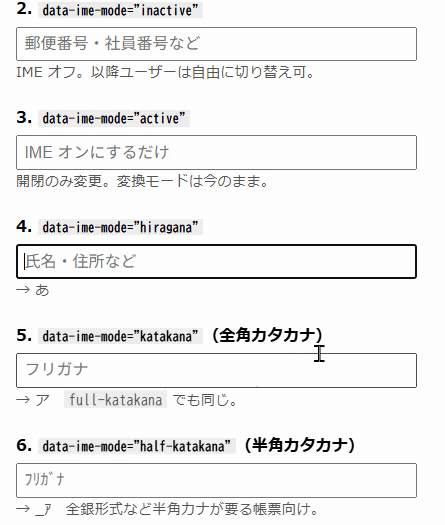
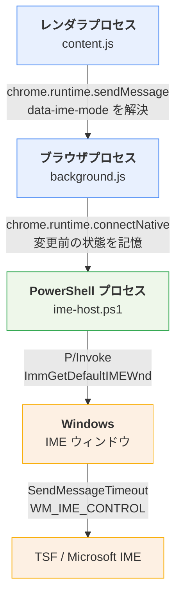
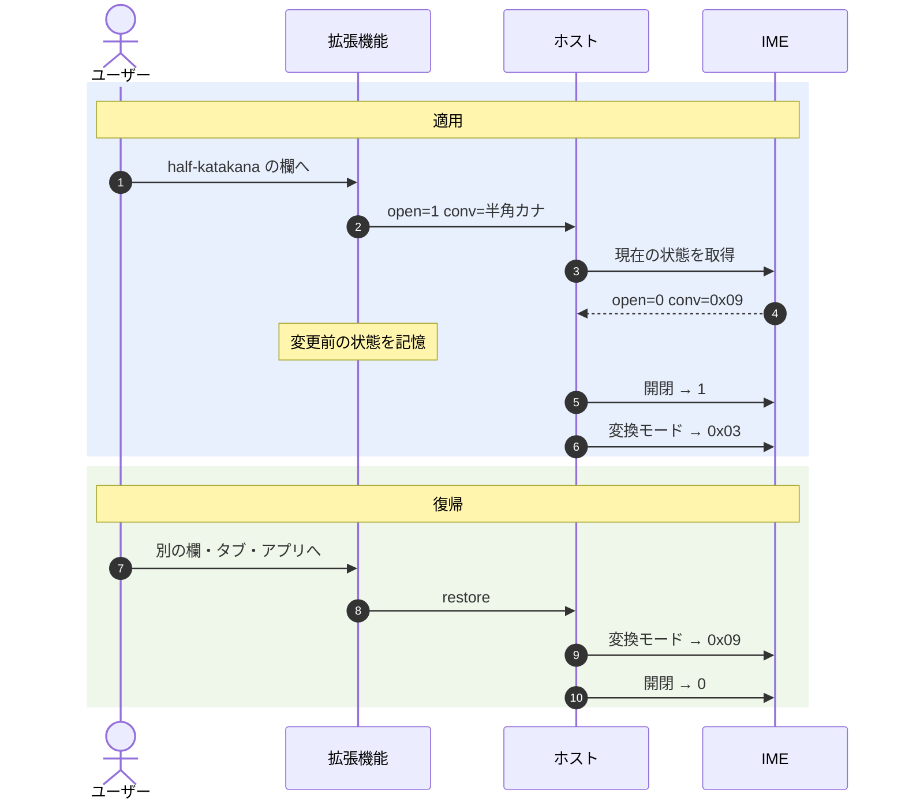
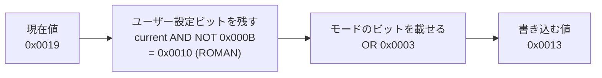
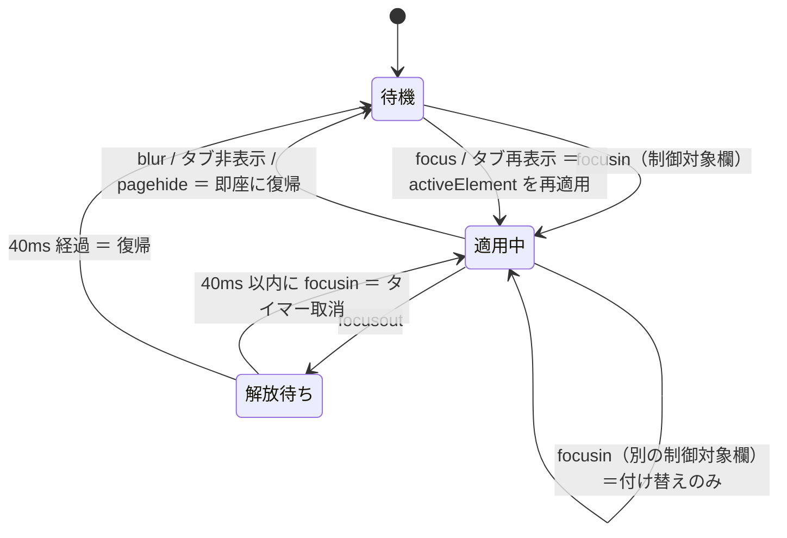

# data-ime-mode

IE の CSS `ime-mode` 相当を、Windows の Edge で `data-ime-mode` 属性として再現するブラウザ拡張です。

```html
<input type="text" data-ime-mode="half-katakana">
```



| 値 | フォーカス時の挙動 | IME 表示 |
|---|---|---|
| `inactive` | IME オフ | A |
| `active` | IME オン（変換モードは変えない） | — |
| `hiragana` | IME オン＋ひらがな | あ |
| `katakana` / `full-katakana` | IME オン＋全角カタカナ | ア |
| `half-katakana` | IME オン＋半角カタカナ | _ｱ |

その他の値・属性なしの要素は無視します。フォーカスが外れると
**開閉状態・変換モードとも元に戻します**。

いずれも「フォーカス時に状態を設定する」だけで、以降ユーザーは自由に
切り替えられます（IE の `ime-mode: inactive` / `active` と同じ考え方）。
IE の `ime-mode: disabled` のように切り替えを禁止することはできません。

ただし復帰は「フォーカス前の状態」に戻す動作なので、欄の中でユーザーが選び直した
モードはフォーカスを外した時点で失われます。詳しくは
[フォーカス以外のきっかけ](#フォーカス以外のきっかけ)。

## この拡張機能がしないこと

`<all_urls>` のコンテンツスクリプトとネイティブメッセージング、その先の
PowerShell という構成は、見た目だけでは何をしていても不思議ではありません。
やっていないことを先に書きます。

- **入力値を読みません。** content.js が要素から読むのは `data-ime-mode`
  属性の値だけです。`value` にも `input` イベントにも触れません。
- **通信しません。** ネットワークへ出る処理がありません。`host_permissions`
  も持たず、権限は `nativeMessaging` の 1 つだけです。
- **テレメトリも保存もありません。** `chrome.storage` を使わず、状態は
  「いま何のモードを適用中か」1 つをメモリに持つだけです。
- **IME の設定を書き換えません。** ホストが触るのは開閉状態と変換モードの
  3 ビット（`NATIVE` / `KATAKANA` / `FULLSHAPE`）だけで、ローマ字入力か
  かな入力かなどユーザー自身の設定はそのまま残します（[しくみ](#しくみ)）。
- **他アプリの IME に手を出しません。** 操作対象は記録しておいた Edge の
  ウィンドウで、フォーカスが Edge から離れている間は要求そのものを送りません。
- **元に戻します。** 欄から離れた時点で、フォーカス前の状態へ戻します。
  拡張機能が落ちてポートが切れた場合もホスト側が終了時に同じ復帰を行います。

本体は content.js・background.js・ime-host.ps1 の 3 ファイルで 570 行ほど、
これに疎通確認のポップアップ（popup.html / popup.js / diagnose.js）が付いて
全体で 800 行に届きません。ビルド工程も依存パッケージもないので、読んだものが
そのまま動きます。

## しくみ

### 構成

4 つのプロセス境界をまたいで属性が IME に届きます。



IMM32 の入力コンテキストはプロセスをまたげませんが、IME ウィンドウへの
`WM_IME_CONTROL` は単なるウィンドウメッセージなので別のプロセスのウィンドウにも届き、
CUAS 経由で TSF の開閉状態にも反映されます。**これがこの構成が成立する理由**です。

### フォーカスから復帰までの流れ

変換モードの変更は IME が開いている間しか反映されません。そのため
**適用時は「開閉 → 変換モード」、復帰時は「変換モード → 開閉」の逆順**で
書き込みます。



復帰先の hwnd は**記録しておいたもの**を使います。その時点のフォアグラウンド
ウィンドウを使うと、ユーザーが移動した先のアプリの IME を書き換えてしまうためです。
ポートが切れた場合はホスト側の `finally` が同じ復帰を行います。

変換モードのビット：

| 定数 | 値 |
|---|---|
| `IME_CMODE_NATIVE` | `0x0001` |
| `IME_CMODE_KATAKANA` | `0x0002` |
| `IME_CMODE_FULLSHAPE` | `0x0008` |

- ひらがな = `NATIVE | FULLSHAPE` = `0x09`
- 全角カタカナ = `NATIVE | KATAKANA | FULLSHAPE` = `0x0B`
- 半角カタカナ = `NATIVE | KATAKANA` = `0x03`

ホストは**この 3 ビットだけを書き換えます**。`IME_CMODE_ROMAN`
（ローマ字入力 / かな入力の別）などユーザー自身の設定は保存されます。



### フォーカス以外のきっかけ

content.js が持つ状態は「いま何のモードを適用中か」の 1 つだけです
（`currentMode`）。これがフレームごとに次のように遷移します。



**離脱では 40ms 待たずに即座に復帰します。** 隣の欄へ移るだけなら
40ms のコアレス窓で復帰を取り消して適用だけで済みますが、Alt+Tab で他アプリへ移った場合に
待つ理由はありません。待つと、切り替え先のメモ帳が半角カナのまま、という
状態が一瞬とはいえ発生します。

**戻ってきたら再適用します。** 離脱時に復帰させる以上、同じ欄にフォーカスが
残ったまま戻ってきたときは元のモードに戻さないと片道通行になります。復帰は
「フォーカス前の状態」に戻す動作なので、ユーザーが欄の中で選び直したモードは
離脱の時点で既に破棄されており、再適用がそれを上書きすることはありません。

再適用の前には `document.hasFocus()` を確認します。Edge がフォアグラウンドで
ないときにホストへ要求すると、ホストは `hwnd 0` をフォアグラウンドウィンドウと
解決するため、**別のアプリの IME を書き換えてしまう**ためです。

なお `focus` と `focusin` の両方が発火しても、`currentMode` との突き合わせで
2 回目は破棄されるので、発火順序に依存しません。

### 送信に失敗したとき

`chrome.runtime.sendMessage` は 2 通りの壊れ方をします。拡張機能の再読み込み・
無効化では**同期的に throw** し、サービスワーカーへ到達できないときは
**返り値の Promise が reject** します。どちらの場合も「適用済み」の記憶を
破棄します。破棄しないと重複排除が働いて、同じモードの欄をいくら触っても
再送されなくなるためです。

ここには MV3 の落とし穴が 2 つあります。

**① 応答しないと、届いていても reject する。** リスナが `sendResponse` を
呼ばず `true` も返さないと、ポートは無応答のまま閉じ、送信側の Promise は
`The message port closed before a response was received.` で reject します。
これでは「届いた」と「届かなかった」が区別できません。そこで background.js は
**受領だけを同期的に応答します**。実際の適用は直列キューの上で進むので、
完了は待ちません。

**② 失敗を `null` に丸めてはいけない。** `null` は「解放済み」を表す値なので、
失敗を `null` にすると離脱時の `apply(null)` が重複排除で消えます。すると
**復帰要求が送られず、IME が他アプリまで汚染されたまま取り残されます**。
`forget()` は `null` ではなく `UNKNOWN`（`Symbol`）を入れます。どのモード名とも
`null` とも一致しないので、次が適用でも復帰でも必ず送り直されます。

記憶を破棄するのは、その後に別のモードが適用されていない場合だけです。
非同期の失敗が遅れて届いたときに、新しい状態を消さないようにしています。

### 事前起動（prewarm）

ホストの PowerShell プロセスは起動に時間がかかります。同一環境で 3 回ずつ測った値:

| 区間 | 時間 |
|---|---|
| ホスト起動 → 最初の応答（コールド） | 1,220 – 1,310 ms |
| 2 回目以降（ポート確立後） | 0.3 – 2.0 ms |
| 内訳: `powershell.exe` の起動だけ | 637 – 762 ms |
| 内訳: `Add-Type`（C# の実行時コンパイル）だけ | 340 – 468 ms |

フォーカスしてからこの時間がかかると、初回だけ IME の切り替わりが目に見えて遅れます。
そこで content.js は、**属性を持つ要素がある文書を開いた時点で** `ping` を 1 通
送ってホストを起動させておきます。判定は属性の存在だけで、値が既知のモードかは
見ません（値は後から変わりうるうえ、`modeOf()` と判定を二重に持つと食い違います）。

`ping` を選ぶ理由は、ホストがこれを最初に処理して即返し、**ウィンドウ解決も IME
操作もしない**ことです。`lastChange` も設定されないので、prewarm だけしてポートが
切れても復帰処理は走りません。

ポートを持つのはサービスワーカーなので、**1 度起動すれば全タブ・全フレームで共有
されます**。ページ遷移ごとに prewarm は走りますが、プロセスが起動するのは最初の
1 回だけで、2 回目以降は `ping` の往復（~1ms）で終わります。サービスワーカーが
破棄されてポートが切れた場合も、次のページ遷移が起動し直します。

なお、prewarm は `spec` を持たないメッセージです。background.js は**`spec` の判定より
前に**これを分岐させます。後ろに置くと、`msg.spec ? acquire(msg.spec) : release()` の
`release()` 側に落ちて、ページを開くたびに解放が走ります。

読み込み時点で対象欄が無く、あとから JavaScript で追加される文書だけは prewarm の
対象外です。その場合でも、同じセッションで属性を含むページを 1 度開いていれば
ホストは既に起動しています。

#### Edge の起動時

上の prewarm では塞げない場面があります。対象欄が `autofocus` されているページでは、
**属性が見えるようになる瞬間とフォーカスが起きる瞬間が同じ**なので、prewarm の
利得がゼロになります。ログインフォームはこの拡張機能の本命の用途で、しかも
`autofocus` を持つことが多いところです。

そのとき起きるのは単なる遅れではありません。1.2 秒のあいだまちがったモードで
打つことになり、**打鍵の途中で IME が切り替わります**。`data-ime-mode="inactive"`
を指定した ID 欄なら、その 1.2 秒は日本語入力のままです。

そこで `background.js` は `chrome.runtime.onStartup`、つまり **Edge の起動時**にも
`ping` を 1 通送ります。ページより前に温まるので、起動直後に開くページなら初回
フォーカスが間に合います。ただし `onStartup` が発火しない経路もあります。後述の
スタートアップ ブーストが有効な場合、拡張機能をセッションの途中で再読み込みした
場合、それにサービスワーカーが破棄されてポートが切れた場合です。最後のものは、
次のページ遷移でページ側の prewarm が起動し直します。

代償として、対象の欄を 1 度も触らない日でも、Edge を開いている間ずっとホストが
常駐します。実測でコミット 58.1 MB（起動直後の WorkingSet は 83.8 MB ですが、
アイドルのプロセスは Windows に切り詰められます）。CPU は 20 秒ごとの keepalive
込みでほぼゼロです。

なお Edge の「スタートアップ ブースト」やバックグラウンドでの実行が有効な場合、
ウィンドウを閉じてもブラウザ本体は終了しないため、次にウィンドウを開いても
起動時の事前起動は走りません。その状態ではポートもホストも生き続けているので、
起動し直す必要がないからです。この設定では、起動時の事前起動が効くのは再起動や
ログオンのあとの 1 回目になります。

## インストール

1. `edge://extensions` を開き「開発者モード」を ON
2. 「展開して読み込み」で本リポジトリの `extension\` を選択
3. PowerShell で登録：

```powershell
powershell -ExecutionPolicy Bypass -File host\install.ps1
```

4. Edge を**完全に終了**して起動し直す
5. ツールバー右上の**パズルピース型の「拡張機能」ボタン**から data-ime-mode を選び、
   「**✓ ネイティブホストに接続できています**」を確認
6. `test\test.html` を開いて動作確認

拡張機能 ID は `extension\manifest.json` の `key`（公開鍵）から決まるので、
**フォルダをどこに置いても変わりません**。`install.ps1` はその ID を既定値に
持っているため、引数は要りません。`key` を取り除いた版を読み込んだ場合だけ
`-ExtensionId <32文字のID>` で上書きしてください。

ただし**フォルダを移動・コピーしたら `install.ps1` の再実行が必要**です。ID は
変わりませんが、ホストのマニフェストに書き込まれる `ime-host.bat` の絶対パスが
変わるためです。旧フォルダの登録がレジストリに残ったままだと、Edge は旧フォルダの
ホストを起動し続けます。コードを直したのに反映されない、という形で現れます。
`install.ps1` は付け替えが起きたときに旧パスを表示するので、そこで気付けます。

### 動かないとき

拡張機能のアイコン（青地に「あ」）をクリックすると、ホストへ実際に `ping` を通した
結果が出ます。未登録・往復できないはどちらも「欄にフォーカスしても何も起きない」と
いう同じ見え方になるので、まずここで切り分けてください。

展開して読み込んだ拡張機能はツールバーに自動では並びません。**パズルピース型の
「拡張機能」ボタン**を押すと一覧に出ます。行の右にあるピンを押せば常時表示に
できます。ポップアップにはホスト名と拡張機能 ID も出るので、レジストリの登録と
突き合わせられます。

| 表示 | 意味 | 対処 |
|---|---|---|
| ✓ 接続できています | ホストまで往復できている | 欄の挙動を `test\test.html` で確認 |
| ホストが登録されていません | レジストリに登録がない | `install.ps1` を実行し、Edge を再起動 |
| 登録されているが往復できない | 旧フォルダを指したままか、ホストが起動できず即終了している | フォルダを移動したなら `install.ps1` を再実行。そうでなければ Constrained Language Mode / EDR が `Add-Type` を止めていないか確認（[既知の制約](#既知の制約)）。`host\debug.on` を置くとログが残る |

#### カードが `edge://extensions` に見当たらない

**開発者モードが OFF になっていないか**を見てください。OFF にすると Edge は展開して
読み込んだ拡張機能を降ろします。このとき設定には「有効」という記録だけが残るので、
ON に戻しても復活しません。`extension\` を**もう一度「展開して読み込み」して
ください**。ID は `key` で固定されているので、読み込み直しても `install.ps1` の
再実行は要りません。

#### 動作の確かめ方

**欄にフォーカスしたまま、実際に打ってください。** `half-katakana` の欄で `aiueo` と
打って `ｱｲｳｴｵ` になれば動いています。

タスクバーの IME 表示を見に行くつもりで別のウィンドウへ切り替えると、その時点で
フォーカスが Edge から離れ、**設計どおり元の状態へ復帰します**。「モードが切り替わら
ない」と見えるものの多くはこれで、拡張機能自体は正しく動いています。適用と復帰が
起きているかは `host\debug.on` を置けば分かります。対で記録されます。

### アンインストール

```powershell
powershell -ExecutionPolicy Bypass -File host\uninstall.ps1
```

## 既知の制約

- **IME 状態は Edge のウィンドウ単位でグローバル**です。フィールド単位で
  持てるものではないため、blur / タブ切替 / ウィンドウのフォーカス喪失で
  必ず元に戻し、戻ってきたら適用し直す実装になっています。
- IME 表示の見た目（`_ｱ` など）は IME の種類・設定によって異なります。
- **iframe をまたぐフォーカス移動**：content.js の状態はフレーム単位なので、
  別フレームの制御対象欄へ移ると離脱側の 40ms タイマーが後から発火して
  復帰させてしまいます。単一ドキュメントのフォームでは起きません。
- サービスワーカーが破棄されるとポートが切れます。その場合はホスト側が
  終了時に元の状態へ復帰させるので、IME が変更されたまま残ることはありません。
- ホストプロセスは **Edge の起動時**に立ち、以降はポートが繋がったままなので
  セッション中 1 回だけです（[事前起動](#事前起動prewarm)）。**この拡張機能を
  入れている間は、対象の欄を使わない日でもホストが常駐します。**
- 企業の管理端末で AppLocker / WDAC による Constrained Language Mode が
  有効な場合、`Add-Type` の P/Invoke がブロックされて動作しません。
  EDR がブラウザからの PowerShell 起動を遮断する構成でも同様です。

## テスト

| 実行するもの | 確認内容 |
|---|---|
| `node test\content.test.js` | content.js の状態遷移。上の状態遷移図の各辺と、送信失敗からの復帰 |
| `powershell -File test\host.test.ps1` | ホストの変換モード計算。適用時のマスクと復帰時の書き戻し |
| `powershell -File test\host.e2e.ps1` | ホストを実際に起動し、`WM_IME_CONTROL` の往復まで通した動作。適用・復帰・ポート断の保険 |
| `test\test.html` | 拡張機能を入れた状態での実際の IME 表示 |
| `test-ime-toggle.ps1` | 拡張機能を介さず、IME のオン/オフ切り替えが自環境で効くか |
| `test-ime-conversion.ps1` | 同上、ひらがな / 全角カタカナ / 半角カタカナの切り替え |

上 2 つは依存パッケージも Edge も不要で、**IME には一切触りません**。
`content.test.js` は最小限の DOM と `chrome.runtime` のスタブ上で content.js を
読み込みます。`host.test.ps1` は `ime-host.ps1` から関数定義を AST で取り出し、
Win32 呼び出しをスタブに差し替えて計算だけを確認します。

`host.e2e.ps1` はホストを Native Messaging プロトコルで起動し、background.js が
送るのと同じ JSON を流します。合否はホストの返答ではなく、スクリプト自身の Win32
読み取りで判定します。**IME を実際に操作しますが、対象は使い捨ての専用ウィンドウ
だけ**なので Edge と今の IME 状態には触りません。相手が WinForms のテキストボックス
であって Edge ではない点が、この確認の届く範囲です。`-Log` を付けるとホストの
診断ログも残ります。

ブラウザ側（`focusin` / 離脱 / 再適用）を実際の Edge で動かす確認は、
`test\test.html` を開いて手で行います。

### 診断ログ

`host\debug.on` を置くと、ホストが読み書きした値を `host\debug.log` に記録します
（stdout はプロトコル専用なので必ずファイルへ出します）。要求 JSON、対象 hwnd、
IMC の往復と所要時間、計算した target、書き込み後の読み直し（直後と 250ms 後）が
残ります。有効化にはホストの再起動＝拡張機能の再読み込みが必要です。
確認が終わったら `host\debug.on` を削除してください。

## ライセンス

MIT License（[LICENSE](LICENSE)）
