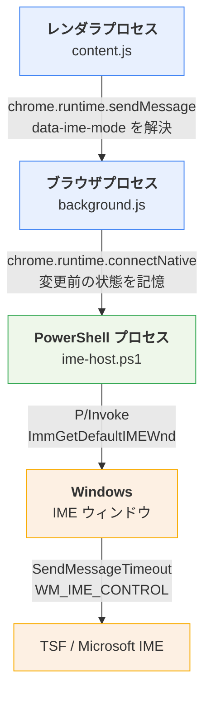
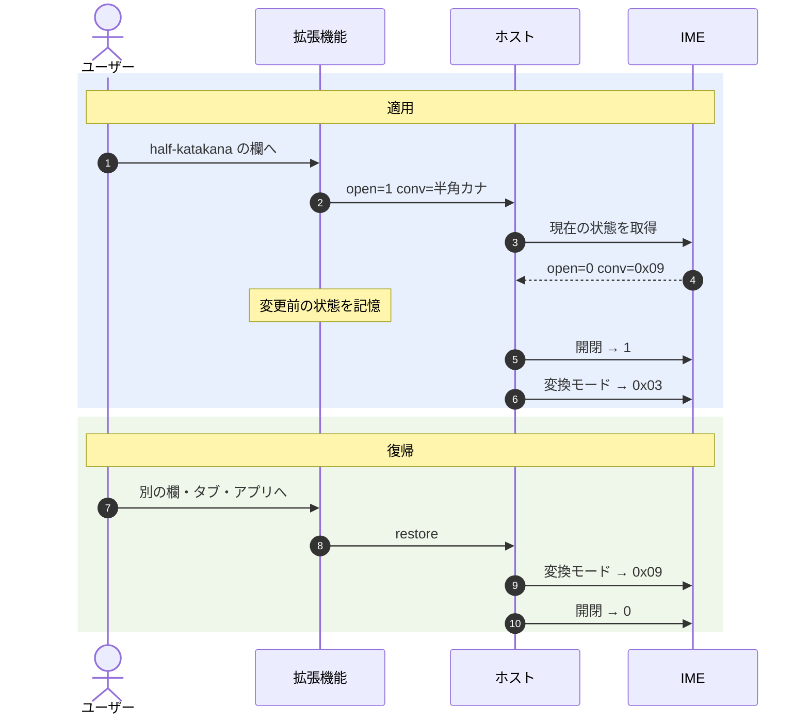
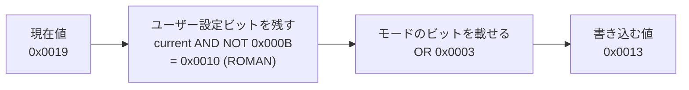

# data-ime-mode

IE の CSS `ime-mode` 相当を、Windows の Edge で `data-ime-mode` 属性として再現するブラウザ拡張です。

```html
<input type="text" data-ime-mode="half-katakana">
```

| 値 | フォーカス時の挙動 | IME 表示 |
|---|---|---|
| `inactive` | IME オフ | A |
| `active` | IME オン（変換モードは変えない） | — |
| `hiragana` | IME オン＋ひらがな | あ |
| `katakana` / `full-katakana` | IME オン＋全角カタカナ | ア |
| `half-katakana` | IME オン＋半角カタカナ | _ｱ |

その他の値・属性なしの要素は無視します。フォーカスが外れると
**開閉状態・変換モードとも元に戻します**。

いずれも「フォーカス時に状態を設定する」だけで、以降ユーザーは自由に
切り替えられます（IE の `ime-mode: inactive` / `active` と同じ考え方）。
IE の `ime-mode: disabled` のように切り替えを禁止することはできません。

## しくみ

### 構成

4 つのプロセス境界をまたいで属性が IME に届きます。



IMM32 の入力コンテキストはプロセスをまたげませんが、IME ウィンドウへの
`WM_IME_CONTROL` は単なるウィンドウメッセージなのでプロセス境界を越え、
CUAS 経由で TSF の開閉状態にも反映されます。**これがこの構成が成立する理由**です。

### フォーカスから復帰までの流れ

変換モードの変更は IME が開いている間しか反映されません。そのため
**適用時は「開閉 → 変換モード」、復帰時は「変換モード → 開閉」の逆順**で
書き込みます。



復帰先の hwnd は**記録しておいたもの**を使います。その時点のフォアグラウンド
ウィンドウを使うと、ユーザーが移動した先のアプリの IME を書き換えてしまうためです。
ポートが切れた場合はホスト側の `finally` が同じ復帰を行います。

変換モードのビット：

| 定数 | 値 |
|---|---|
| `IME_CMODE_NATIVE` | `0x0001` |
| `IME_CMODE_KATAKANA` | `0x0002` |
| `IME_CMODE_FULLSHAPE` | `0x0008` |

- ひらがな = `NATIVE | FULLSHAPE` = `0x09`
- 全角カタカナ = `NATIVE | KATAKANA | FULLSHAPE` = `0x0B`
- 半角カタカナ = `NATIVE | KATAKANA` = `0x03`

ホストは**この 3 ビットだけを書き換えます**。`IME_CMODE_ROMAN`
（ローマ字入力 / かな入力の別）などユーザー自身の設定は保存されます。



## インストール

1. `edge://extensions` を開き「開発者モード」を ON
2. 「展開して読み込み」で本リポジトリの `extension\` を選択
3. 表示された **拡張機能 ID**（英小文字 32 文字）を控える
4. PowerShell で登録：

```powershell
powershell -ExecutionPolicy Bypass -File host\install.ps1 -ExtensionId <控えたID>
```

5. Edge を**完全に終了**して起動し直す
6. `test\test.html` を開いて動作確認

`extension\` フォルダのパスを変えると拡張機能 ID が変わるため、
移動した場合は `install.ps1` を再実行してください。

### アンインストール

```powershell
powershell -ExecutionPolicy Bypass -File host\uninstall.ps1
```

## 既知の制約

- **IME 状態は Edge のウィンドウ単位でグローバル**です。フィールド単位で
  持てるものではないため、blur / タブ切替 / ウィンドウのフォーカス喪失で
  必ず元に戻す実装になっています。
- IME 表示の見た目（`_ｱ` など）は IME の種類・設定によって異なります。
- **iframe をまたぐフォーカス移動**：content.js の状態はフレーム単位なので、
  別フレームの制御対象欄へ移ると離脱側の 40ms タイマーが後から発火して
  復帰させてしまいます。単一ドキュメントのフォームでは起きません。
- サービスワーカーが破棄されるとポートが切れます。その場合はホスト側が
  終了時に元の状態へ復帰させるので、IME が変更されたまま残ることはありません。
- 起動時にコンソールウィンドウが一瞬見えることがあります（`connectNative`
  なのでセッション中 1 回だけ）。
- 企業の管理端末で AppLocker / WDAC による Constrained Language Mode が
  有効な場合、`Add-Type` の P/Invoke がブロックされて動作しません。
  EDR がブラウザからの PowerShell 起動を遮断する構成でも同様です。

## 補助スクリプト

拡張機能を介さず、自分の環境で Win32 側の制御が効くかだけを確認します。

| スクリプト | 確認内容 |
|---|---|
| `test-ime-toggle.ps1` | IME のオン/オフ切り替え |
| `test-ime-conversion.ps1` | ひらがな / 全角カタカナ / 半角カタカナの切り替え |
